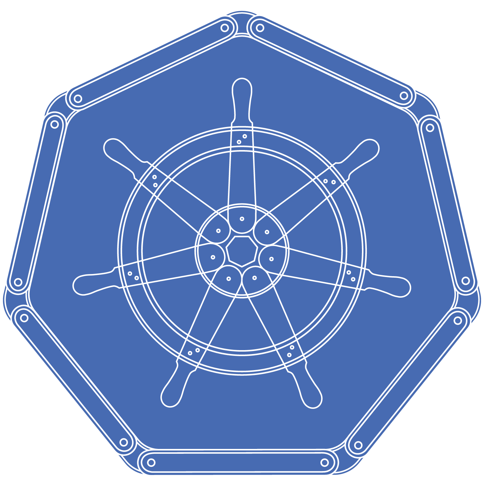

###  Homelab 

_Automatically managed with Flux, Renovate, and Github Actions_ 🤖

   

## 🛠️ Tools

| Tool                                     | Purpose                                                                          |
|------------------------------------------|----------------------------------------------------------------------------------|
| [Flux](https://fluxcd.io/flux/)          | Operator to manage your K8S cluster based any number of sources including GitHub |
| [Renovate](https://docs.renovatebot.com) | Tool to automate dependency updates                                              |
| [SOPS](https://github.com/getsops/sops)  | K8S secrets and configmap manager to encrypt secrets with GnuPG for storage      |

## 🖥️ Nodes

| Node            | RAM  | Storage                   | Role   | OS            | Accessories                                                                            |
|-----------------|------|---------------------------|--------|---------------|----------------------------------------------------------------------------------------|
| Raspberry Pi 5  | 8GB  | 256GB NVMe SSD            | Master | Raspbian Lite | [Hat](https://www.waveshare.com/poe-m.2-hat-plus.htm), [Drive](https://a.co/d/4kcOG6z) |
| Raspberry Pi 5  | 8GB  | 256GB NVMe SSD            | Master | Raspbian Lite | [Hat](https://www.waveshare.com/poe-m.2-hat-plus.htm), [Drive](https://a.co/d/4kcOG6z) |
| Raspberry Pi 5  | 8GB  | 256GB NVMe SSD            | Master | Raspbian Lite | [Hat](https://www.waveshare.com/poe-m.2-hat-plus.htm), [Drive](https://a.co/d/4kcOG6z) |
| Raspberry Pi 5  | 8GB  | 256GB NVMe SSD            | Worker | Raspbian Lite | [Hat](https://www.waveshare.com/poe-m.2-hat-plus.htm), [Drive](https://a.co/d/4kcOG6z) |
| Raspberry Pi 5  | 8GB  | 256GB NVMe SSD            | Worker | Raspbian Lite | [Hat](https://www.waveshare.com/poe-m.2-hat-plus.htm), [Drive](https://a.co/d/4kcOG6z) |
| N95 Mini PC     | 32GB | 2TB NVMe SSD              | Worker | Debian        |                                                                                        |

## 📦 Storage

| Node    | RAM   | Storage             | Function              | OS            |
|---------|-------|---------------------|-----------------------|---------------|
| TrueNAS | 128GB | 12 x 8TB HDD RAIDZ3 | Multi-purpose Storage | TrueNAS Scale |

## 🛜 Network 

| Vendor   | Model             | Function                                        |
|----------|-------------------|-------------------------------------------------|
| Ubiquiti | Dream Machine Pro | Primary Router, Camera Storage, Network Manager |
| Ubiquiti | US-48-500W        | Rack switch with PoE and 10G SFP+               |
| Ubiquiti | U6-LR             | Wireless Access Point                           |

## ☁️ Cloud Services

| Service                                              | Use                                        | Cost            |
|------------------------------------------------------|--------------------------------------------|-----------------|
| [Backblaze](https://www.backblaze.com/cloud-storage) | Offsite S3 storage for important files     | ~$100/yr        |
| [Bitwarden](https://bitwarden.com)                   | Password management                        | Free            |
| [Cloudflare](https://www.cloudflare.com/)            | Domains and DNS management                 | ~$70/yr         |
| [GitHub](https://github.com/)                        | Hosting this repo and CI/CD                | Free            |
| [Let's Encrypt](https://letsencrypt.org/)            | Issuing SSL Certificates with Cert Manager | Free            |
| [UniFi Site Manager](https://unifi.ui.com)           | UniFi External Access Management           | Free            |
|                                                      |                                            | Total: ~$170/yr |
